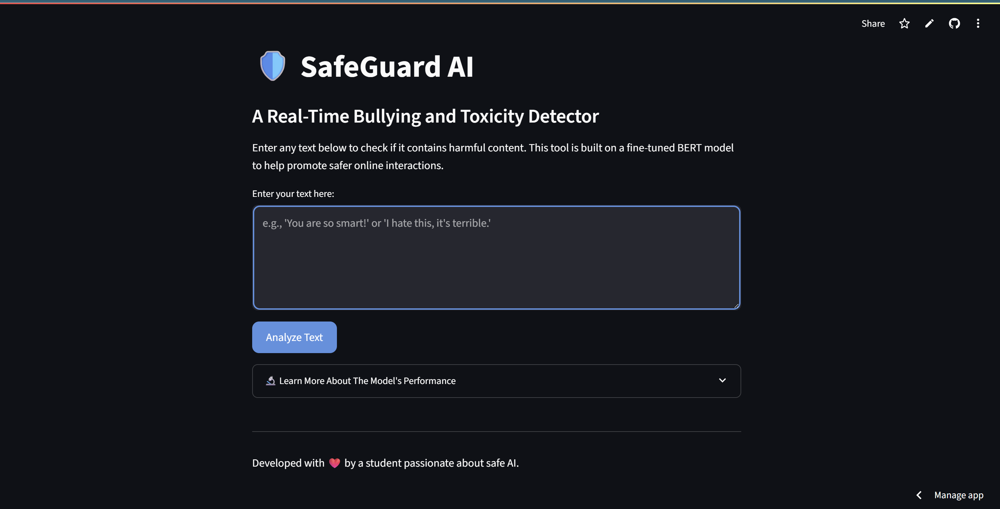

# 🛡️ SafeGuard AI - Bullying & Toxicity Detector

A real-time text classification tool built to detect and flag harmful content, including bullying, insults, and toxic comments. This project uses a fine-tuned **BERT** model to understand context and nuance, promoting safer online interactions.

If you find this project useful or interesting, please consider giving it a ⭐ star!

[](https://safegaurd-ai.streamlit.app/)

---
## 🚀 Live Demo

You can try the live application here:

**[https://safegaurd-ai.streamlit.app/](https://safegaurd-ai.streamlit.app/)**



---
## ✨ Key Features

* **High-Performance Detection**: Accurately classifies text into 'Bullying' or 'Not Bullying' categories.
* **State-of-the-Art Model**: Powered by a fine-tuned **BERT** model, allowing it to understand context, sarcasm, and other nuances.
* **Interactive UI**: A simple and clean user interface built with **Streamlit**.
* **Ready to Use**: The repository includes the pre-trained model files, ready for deployment.

---
## 📊 Model Performance

The model was fine-tuned on a balanced dataset of over 115,000 text samples, achieving a **93% accuracy**. It is particularly effective at identifying harmful content, with a **96% recall** on bullying comments.


---
## 🛠️ Tech Stack

* **Python**
* **PyTorch**: For deep learning.
* **Hugging Face Transformers**: For using the BERT model.
* **Scikit-learn**: For performance metrics.
* **Streamlit**: For building the interactive web app UI.

---
## ⚙️ Getting Started

Follow these instructions to get a copy of the project up and running on your local machine.

### Prerequisites

You need to have Python 3 and Git LFS installed.
* [Python 3](https://www.python.org/downloads/)
* [Git LFS](https://git-lfs.github.com)

### Installation

1.  **Clone the repository:**
    ```sh
    git clone [https://github.com/your-username/your-repository-name.git](https://github.com/your-username/your-repository-name.git)
    cd your-repository-name
    ```

2.  **Install Git LFS files:**
    ```sh
    git lfs pull
    ```

3.  **Create a virtual environment (recommended):**
    ```sh
    python -m venv venv
    source venv/bin/activate  # On Windows: venv\Scripts\activate
    ```

4.  **Install the required packages:**
    ```sh
    pip install -r requirements.txt
    ```

### Usage

To run the app locally, use the following command in your terminal:
```sh
streamlit run app.py
```

---
## 🤝 Contributing

Contributions are welcome! Please feel free to fork the repository, make changes, and open a pull request.

1.  Fork the Project
2.  Create your Feature Branch (`git checkout -b feature/AmazingFeature`)
3.  Commit your Changes (`git commit -m 'Add some AmazingFeature'`)
4.  Push to the Branch (`git push origin feature/AmazingFeature`)
5.  Open a Pull Request

---
## 📄 License

This project is distributed under the MIT License. See `LICENSE` for more information.
